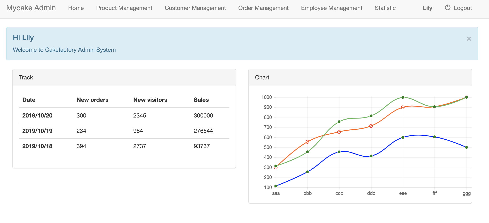
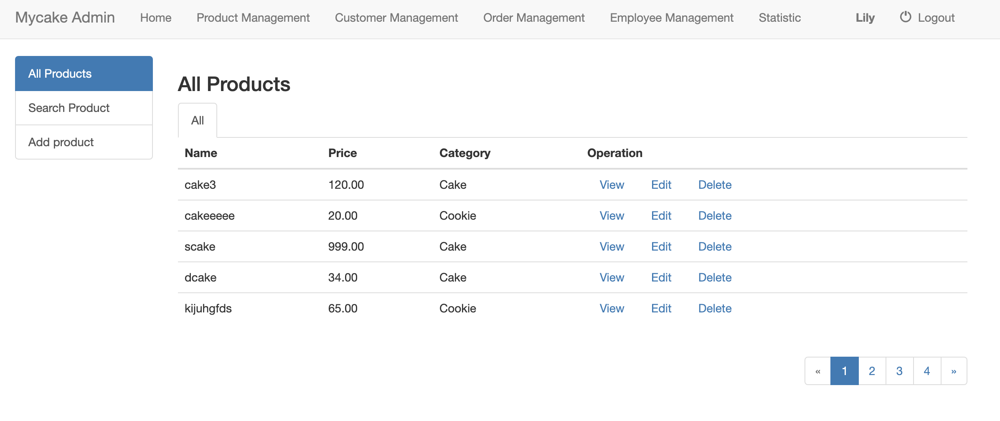
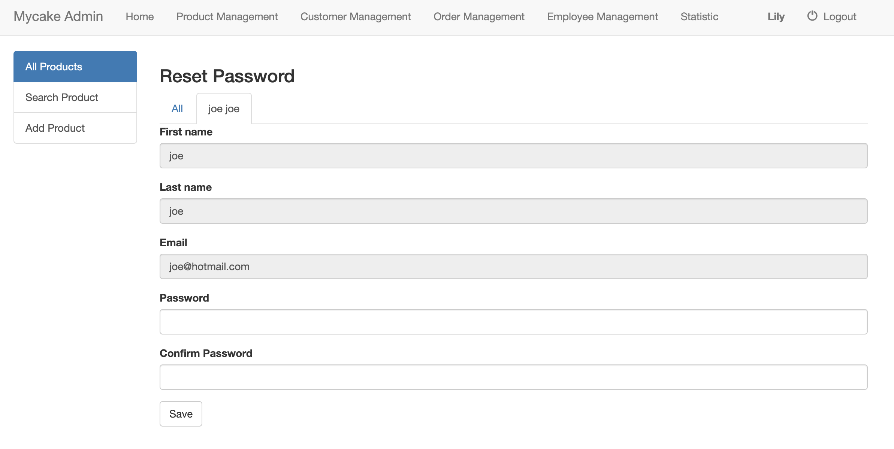

# Online Shopping Application Admin
> This project has been refactored by Laravel, if you are interested in it, click here: [Online-Shopping-Admin-Lararvel](https://github.com/maorutian/Online-Shopping-Admin-Lararvel)  

## Technical skills
Pure PHP + DatabaseAPI:PDO + Bootstrap + XAMMP
## Introduction
  This is a cake online shopping application admin side.
#### This application has the following functions:
 - Admin login/logout
 - Products
	- View available products and prices
	- Review, add, modify and delete individual product details
- Employees
	- View individual employee information
	- Review, add, modify and delete employee details
## Files/Folders Structure
Here is a brief explanation of the template folder structure and some of its main files usage:

```
└── src                                 # Contains all template source files.
│   └── private                         # Contains Classes and Libraries that should not be accessible by public.
│   │   └── classes                     # .
│   │   │   └── DatabaseObject.php      # Employee Class.
│   │   │   └── Employee.php            # .
│   │   │   └── Pagination.php          # Product Class.
│   │   │   └── Product.php             # .
│   │   │   └── Session.php             # Custom Session Class.
│   │   │
│   │   └── shared                      # Contains page layout.
│   │   │   └── admin_footer.php        # Footer layout.
│   │   │   └── admin_header.php        # Headed layout.
│   │   │
│   │   └── database_functions.php      # Functions related to database.
│   │   └── db_credentials.php          # Database credentials.
│   │   └── functions.php               # Libray of functions.
│   │   └── initialize.php              # Load all the required files, all the php files in the public need import it
│   │   └── validation_functions.php    # Libray of data validation functions.
│   │ 
│   └── public                          # Web document route.
│   │   └── css                         # Contains all CSS files.
│   │   │   └── bootstrap_admin.css     # Custom CSS for the project.
│   │   │   
│   │   └── js                          # Contains all JavaScript files.
│   │   │   └──chart.js                 # Chart.js(https://www.chartjs.org)
│   │   │   └──script.js                # Custom own chart using Chart.js.
│   │   │   
│   │   └── employees                   # Contains all employees pages.
│   │   │   └── add.php                 # Create a new employee.
│   │   │   └── delete.php              # Delete individual employee.
│   │   │   └── index.php               # View all employees.
│   │   │   └── update.php              # Update individual employee inforation(except password).
│   │   │   └── update_password.php     # Update individual employee password.
│   │   │   
│   │   └── product                     # Contains all product pages.
│   │   │   └── add.php                 # Create a new project.
│   │   │   └── delete.php              # Delete individual product.
│   │   │   └── detail.php              # Review individual product details.
│   │   │   └── index.php               # View all products.
│   │   │   └── update.php              # Update individual product details.
│   │   │   
│   │   └── customers                   # Contains all customer pages(empty).
│   │   └── orders                      # Contains all orders pages(empty).
│   │   └── statistic                   # Contains all statistic pages(empty).
|   |   |
│   │   └── index.php                   # Home page.
│   │   └── login.php                   # Login page.
│   │   └── logout.php                  # Logout page.
|   |
└── database                           # Contains database setting.
│   └── plugins                        # Sql file to import in databse.
│
└── readme_media                       # Resources for readme.md.
```


## Advantage
1. Create inheritable database table code(DatabaseObject class) to make project more robust
 - create, read, update, delete, select functions form 
 all tables in database
 - override  parent class's function to fit subclass(Employee class)
 
2. user authentication (session class)
 - keep track user authenticated state.
 - track of when the user last logged in adn set maximum login age
 - add access control to pages
 - dispaly messages from session

3. Back End Pagination
 - manage large sets of data, show a subset of records
 -  SQL LIMIT and SQL OFFSET
 -  Good UI(previous, next and numbered page links)

4. validation functions
 - diverse  validation functions

 It's a good idea to have code in one place, so that it gets edited only one time, and it helps you to maintain the code, and also keeps you from making careless mistakes. 

## Disadvantage

1. complicated relationship
 - Due to I create DatabaseObject class, I do not want to only hard code for "joing", I still want one to many and many to many relationships are inheritable functions, but it is diffcult to do.
2. Hard to do teamwork
 - Different team member create same functions. Different team member use different model.


Therefore, I refactored the project using LARAVEL. Click here: [Online-Shopping-Admin-Lararvel](https://github.com/maorutian/Online-Shopping-Admin-Lararvel)  


## Screen Views




